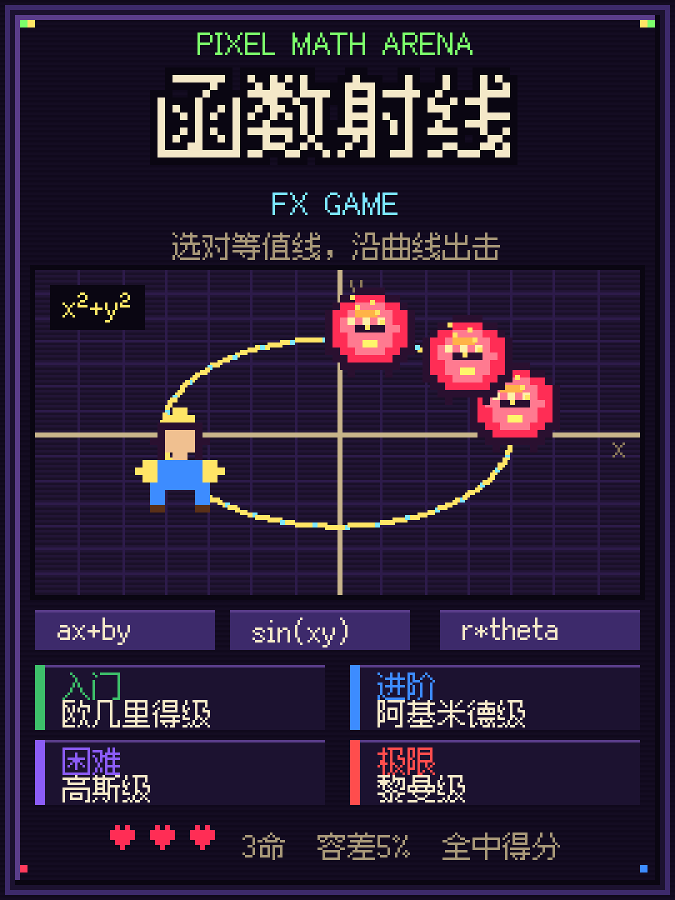

# 函数射线 / FX GAME

小红书小工具格式的像素风 H5 小游戏：角色和怪物都在平面上，从 3 个公式里选出 **过角色的那条等值线**，沿曲线发射攻击，击中全部怪物。容差 5%。

## 宣传海报

3:4 像素海报（1080×1440），适合小红书封面。角色与怪物使用游戏内原版精灵。



插画风海报见 `promo/poster-keyart.png`。重新生成：

```bash
pip install pillow fonttools brotli
python3 promo/render_poster.py
```

## 难度

| 档 | 称号 | 时限 | 怪物 | 函数 |
| --- | --- | --- | --- | --- |
| 入门 | 欧几里得级 | 20s | 1 | `ax+by`、`x²+y²`、`x`、`y` |
| 进阶 | 阿基米德级 | 25s | 1 | `sin(xy)`、`cos(x)+cos(y)`、`e^{x+y}`、`xy` |
| 困难 | 高斯级 | 30s | 2 须全中 | 椭圆、圆、菱形、`atan2`、根式（无一次/二次多项式） |
| 极限 | 黎曼级 | 30s | 3 须全中 | 高斯径向、心脏线、调和函数、`rθ` |

命中得分：`(100 + floor(剩余秒 × 8)) × 档位倍率`（1 / 1.2 / 1.5 / 2）。最高分按档保存。

## 本地预览

```bash
npm install
npm run dev
```

## 打包上传

```bash
npm run build
npm run validate
```
